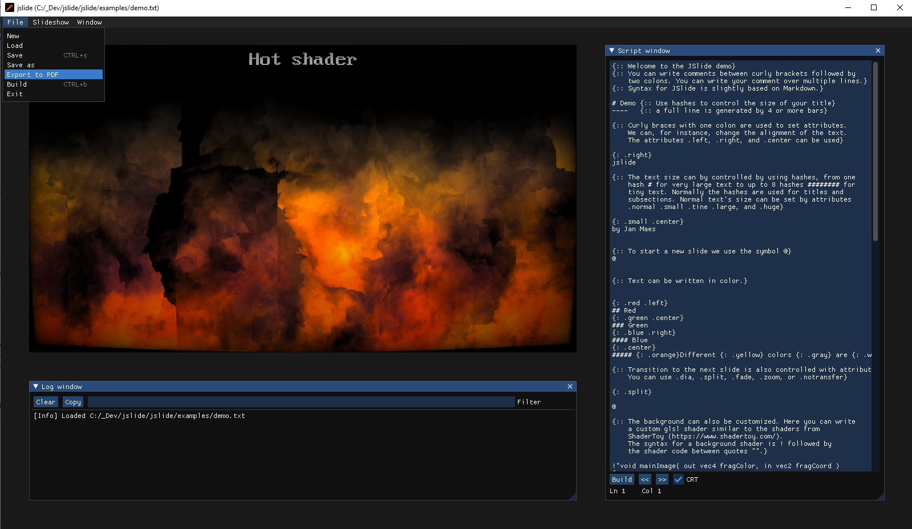

# jslide
Presentation software for nerds

Dear ImGui interface with option to export the presentation to PDF.

## Building
On Windows, all dependencies are delivered with the code, but don't forget to call

    git submodule update --init
    
to download the submodules.
Next use CMake to create a solution file on Windows, or an XCode project on macOS. You have to set the CMAKE variables JSLIDE_ARCHITECTURE and JSLIDE_PLATFORM to the correct values. The defaults are correct for Windows, but if you have macOS with an ARM processor, you have to change these values with CMake to `arm` and `macos` respectively.

On MacOs you also have to install FFmpeg yourself. You can do this with the command

    brew install ffmpeg
    
It's possible that the links to the macos installed version of ffmpeg are incorrect in the CMakeLists.txt file. In that case you'll have to fix the links and let them point to the correct location.
It's also possible to build without FFmpeg. In that case, remove any occurence of the line

    add_definitions(-D_FFMPEG_SUPPORTED)

in the CMakeLists.txt file.

## How to use
Build the application and then open the [demo.txt](examples/demo.txt) or the  the [demo_mac.txt](examples/demo_mac.txt) file in the examples folder, depending on whether your on macOS or not. This demo file explains the syntax (which is sligthly based on Markdown).
